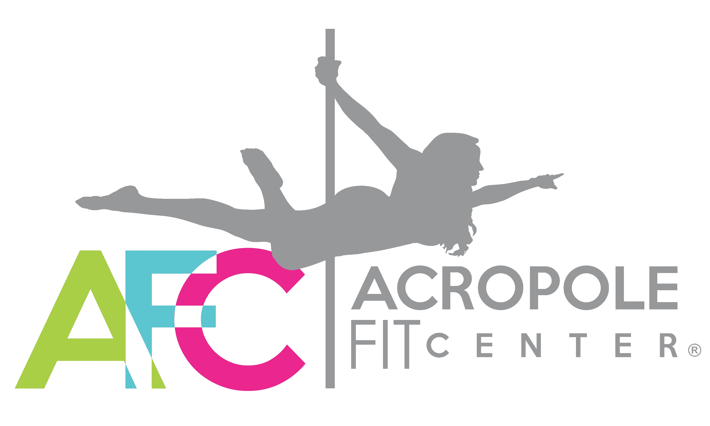

<p align="center">
  
</p>

<h1 align="center">Acropole Fit Center</h1>

Sitio web del studio **Acropole Fit Center** — un espacio para mujeres en Loja, Ecuador, dedicado al Pole Dance, Pole Sport, entrenamiento funcional y flexibilidad.

> _"Más que un studio, somos una comunidad. Aquí el cuerpo no se juzga, se celebra."_

**En vivo →** [acropole-fit-center.vercel.app](https://acropole-fit-center.vercel.app/)

## Stack

- **[Next.js 14](https://nextjs.org)** (App Router) — React 18
- **JavaScript** (sin TypeScript)
- **CSS Modules** — un `.module.css` por componente, sin estilos inline
- **[lucide-react](https://lucide.dev)** — iconos (sin emojis)
- **[next/font](https://nextjs.org/docs/app/api-reference/components/font)** — Poppins + Quicksand de Google Fonts
- **Context API** para i18n y persistencia en `localStorage`

## Características

- Diseño fresco y femenino, paleta `#FF65C3 · #0AD0EB · #7ED956 · #97989A`
- **Modo claro y oscuro** con detección automática (`prefers-color-scheme`)
- **Idiomas español e inglés** — se persiste la preferencia del usuario
- Responsive — menú móvil centrado, tabla de horario con scroll horizontal
- Sin dependencias pesadas — bundle liviano

### Secciones

| Sección | Resumen |
|---|---|
| `Hero` | Título principal con CTAs a reserva y disciplinas |
| `About` | Pilares de la marca: amor propio, comunidad, bienestar |
| `Disciplines` | Pole Dance, Pole Sport, Funcional, Flexibilidad — con sustento de por qué cada una es deporte |
| `Benefits` | 6 beneficios respaldados por ciencia del ejercicio |
| `Plans` | 3 planes mensuales con CTA a WhatsApp pre-cargado |
| `Schedule` | Horario semanal por hora/día + nota de disponibilidad |
| `Story` | Historia de Cristina Marín, fundadora |
| `Contact` | Reservas, dirección, teléfono, redes y correo |

## Empezar

Requisitos: **Node 18+** y **npm**.

```bash
# clonar
git clone git@github.com:KBGR55/acropole-fit-center.git
cd acropole-fit-center

# instalar dependencias
npm install

# correr en desarrollo
npm run dev
```

Abrí `http://localhost:3000`.

### Scripts

| Comando | Descripción |
|---|---|
| `npm run dev` | Servidor de desarrollo (hot reload) |
| `npm run build` | Compila para producción |
| `npm run start` | Sirve el build de producción |
| `npm run lint` | Lint de Next.js |

## Estructura

```
acropole-fit-center/
├── app/
│   ├── layout.jsx          # raíz, fuentes, providers, metadata
│   ├── page.jsx            # composición de secciones
│   └── globals.css         # base, container, secciones
├── components/
│   ├── Navbar/
│   ├── Hero/
│   ├── About/
│   ├── Disciplines/
│   ├── Benefits/
│   ├── Plans/
│   ├── Schedule/
│   ├── Story/
│   ├── Contact/
│   ├── Footer/
│   ├── ThemeToggle/        # botón sol/luna
│   └── LanguageToggle/     # botón ES/EN
├── i18n/
│   ├── dictionaries.js     # textos en español e inglés
│   └── I18nProvider.jsx    # context + hook useT()
├── public/
│   └── logos/              # logo.png (horizontal) y logo-letras.png (mark AFC)
├── styles/
│   └── variables.css       # tokens de tema (light + dark)
└── package.json
```

## Personalización

### Tema y colores

Toda la paleta vive en [`styles/variables.css`](./styles/variables.css). El tema oscuro se define con el selector `[data-theme="dark"]` que sobreescribe las variables.

### Textos / traducción

Los textos están centralizados en [`i18n/dictionaries.js`](./i18n/dictionaries.js). Para cambiar una frase, editá el diccionario `es` o `en` correspondiente — los componentes los leen vía `useT()`.


## Créditos

- Studio: **Acropole Fit Center** · [@acropolefitcenter](https://www.instagram.com/acropolefitcenter/)
- Fundadora: **Cristina Marín Peroza** · [@cristmarin](https://www.instagram.com/cristmarin/)
- Historia original: [primerreporte.com](https://primerreporte.com/desde-venezuela-a-loja-el-renacer-de-acropole-fit-center-un-espacio-para-mujeres-valientes/)
